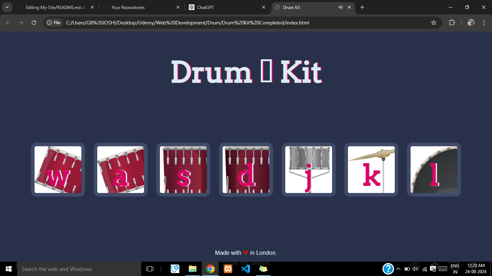

# Drum-Kit - The "Drum Kit" project, designed by Angela Yu, is an interactive web application that simulates a virtual drum set. 
This project allows users to experience the fun of drumming using their computer or mobile device, making it accessible for both casual players and aspiring musicians.

# Purpose :

The "Drum Kit" project is designed to offer an engaging and entertaining way for users to practice drumming techniques, experiment with rhythms, and enjoy the musicality of a virtual drum set. It serves as a fun and educational tool for users interested in music, rhythm, and sound design, providing a hands-on way to explore drumming in a digital environment.

# Features :

1) Virtual Drum Set: A realistic drum kit interface featuring various drum pads and cymbals, including bass drum, snare, hi-hat, toms, and crash cymbal.

2) Interactive Sounds: Each drum pad and cymbal triggers authentic drum sounds when clicked or tapped, replicating the experience of playing a real drum set.

3) Keyboard Integration: Users can also play the drum kit using keyboard shortcuts, where each key corresponds to a specific drum sound for added convenience and accessibility.

4) Responsive Design: The interface is designed to be responsive and functional across different devices, including desktops, tablets, and smartphones.

5) Customizable Sound Effects: Users can adjust the volume and sound effects to tailor the drumming experience to their preferences.
   
6) Visual and Audio Feedback: The project provides visual animations and audio feedback to enhance the interactive experience, simulating the dynamic nature of playing drums.

## Screenshots:
### 1- Screenshot-1

### Links

- Solution URL:  [Solution  URL](https://github.com/yashgjoshi20/Drum-Kit.git)
- Live Site URL: [GitHub Pages Live URL](https://yashgjoshi20.github.io/Drum-Kit/)

### Built with

- Semantic HTML5 markup
- CSS custom properties
- Flexbox
- CSS Grid
- Mobile-first workflow

For the website I've used the following resources:
* ***Icons***: [FlatIcons](https://www.flaticon.com/)
* ***Fonts***: [GoogleFonts](https://fonts.google.com/)
* ***Bootstrap***: [Bootstrap](https://getbootstrap.com/)
* ***External Packagers***: [NPM](https://www.npmjs.com/)

 ## Author

- GitHub - Yash Joshi (https://github.com/yashgjoshi20)
